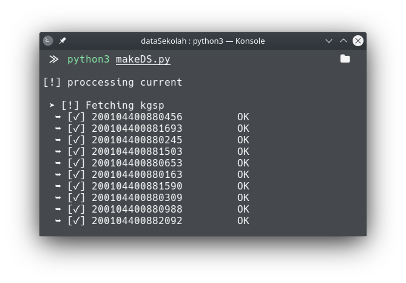
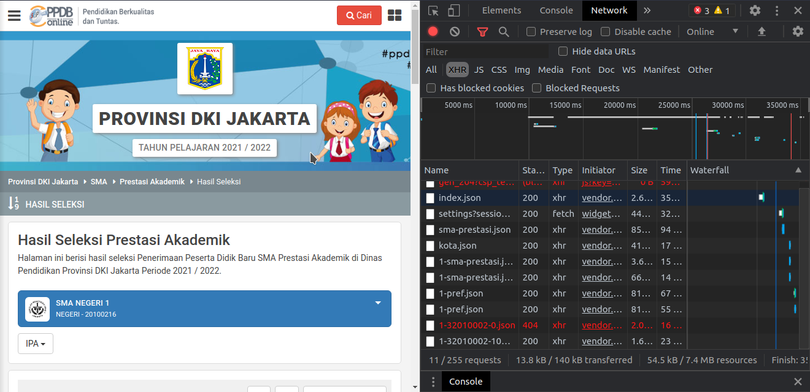
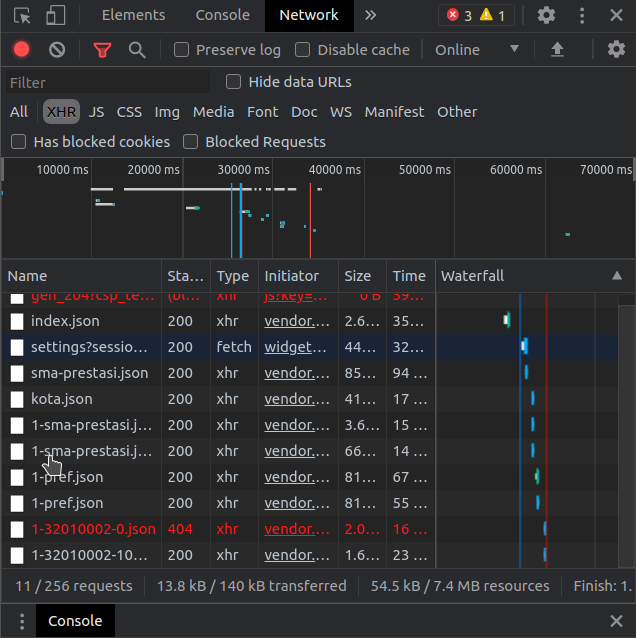
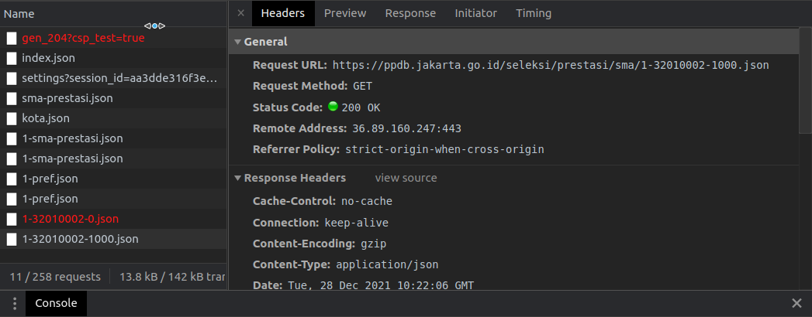

<div id="top"></div>
<!--
*** Thanks for checking out the Best-README-Template. If you have a suggestion
*** that would make this better, please fork the repo and create a pull request
*** or simply open an issue with the tag "enhancement".
*** Don't forget to give the project a star!
*** Thanks again! Now go create something AMAZING! :D
-->


<!-- PROJECT SHIELDS -->
<!--
*** I'm using markdown "reference style" links for readability.
*** Reference links are enclosed in brackets [ ] instead of parentheses ( ).
*** See the bottom of this document for the declaration of the reference variables
*** for contributors-url, forks-url, etc. This is an optional, concise syntax you may use.
*** https://www.markdownguide.org/basic-syntax/#reference-style-links
-->
<!-- PROJECT LOGO -->
<br />
<div align="center">
  <a href="https://github.com/NAoHR/ppdbData">
    
  </a>

  <h3 align="center">PPDBDataMaker</h3>

  <p align="center">
   Sebuah project untuk membuat dataset siap pakai dari data sekolah yang ada pada website resmi ppdb
    <br />
    
</div>


<!-- ABOUT THE PROJECT -->
## Tentang Project ini

PPDBData merupakan suatu program yang saya buat menggunakan bahasa pemrograman python untuk mempermudah mengambil data terkait asal sekolah maupun gender dari siswa pada website ppdb,yang kemudian nantinya akan dibuatkan dataset dengan format json

Fitur pada program ini:
* Request data ke website resmi ppdb untuk mendapatkan data sekolah yang diperlukan
* Request data detail siswa pada tiap sekolah dan jurusan
* Adanya log report bila terjadi error pada pengambilan data
* Mengolah output hasil request dalam format JSON yang disimpan dalam folder dengan berdasarkan tahun data
* Data yang dikeluarkan diformat dalam bentuk json dengan nama format file "jurusan-tahun".json


<!-- GETTING STARTED -->
## Getting Started

Bagian ini akan mencakup cara pengoprasian program ini dimulai dari pencarian data (Pencarian data dilakukan manual telebih dahulu.update selanjutnya akan membuat program ini dapat membuat data secara otomatis),sampai format data yang dapat diterima

### Prerequisites

Untuk versi ini anda diperlukan untuk mengetahui cara melihat ke-api mana website me-request data, contoh :
* 
* 
* 
### Instalasi - Mendapatkan Data

Data bisa anda dapatkan pada laman resmi [ppdb](https://https://ppdb.jakarta.go.id/)
1. Cari api sekolah dengan cara pada bagian prerequisites 
2. Clone repo ini
   ```sh
   git clone https://github.com/NAoHR/ppdbData.git
   ```
3. buat folder data.json dengan format dibawah ini,anda bisa melihat contoh pada [Link ini](https://github.com/NAoHR/ppdbData/blob/main/data.json) dan pastikan dengan format seperti di bawah ini
   ```js
   {
	   "data" : [
		   {
		   "yearType" : "isi section ini dengan menggunakan tipe tahun data ppdb itu dibuat (untuk data tahun ini anda dapat mengisi dengan 'current')",
		   "sourceDataLink" : [ // section ini merupakan list yang akan digunakan untuk menaruh beberapa jurusan yang ada pada sekolah tersebut
				   {
					   "api" : "berisi link api yang sudah didapat dari kolom prerequisits diatas",
					   "vocType" : "berisi tentang jurusan api tersebut contoh: sija,ipa,kgsp,ips,etc"
				   },
				   {
					   // dan seterusnya
				   }	
				]
		   }
	   ]
   }
   ```
4. Ganti nama file sesuai dengan file json yang sudah anda buat pada `makeDS.py`
   ```python
	with  open("data.json","r") as file:
	data = json.load(file)
	file.close()
   ```

<p align="right">(<a href="#top">back to top</a>)</p>


<!-- USAGE EXAMPLES -->
## Usage

Setelah anda berhasil melaksanakan semua pada tahap prerequisite dan instalasi kemudian run program
```sh
python3 makeDs.py
```


<!-- ROADMAP -->
## Roadmap

- [x] Request data di tiap tahun
- [x] Request data di tiap jurusan yang ada di tahun
- [x] Request tiap siswa yang ada pada tiap tiap jurusan kemudian ambil data gender,nama,id,dan sekolah pada siswa tersebut
- [x] Buat Folder untuk tempat penyimpanan output
- [x] Buat Output program dalam format json
- [ ] Buat File data.json menjadi otomatis takperlu cari manual


<!-- LICENSE -->
## License

Distributed under the [MIT](https://choosealicense.com/licenses/mit/) License.