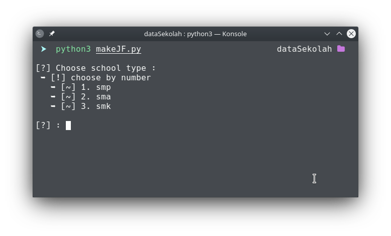
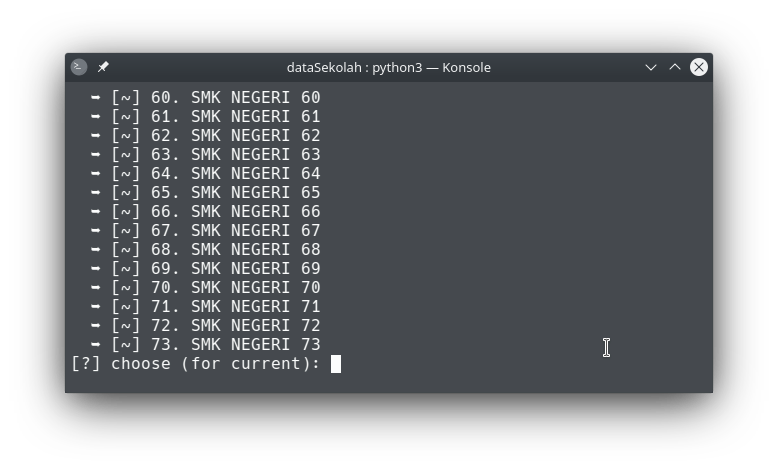
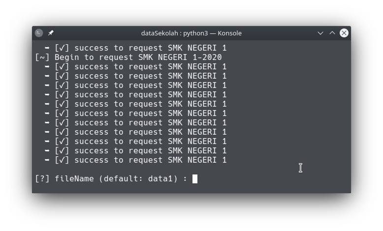

  
<div id="top"></div>
<!--
*** Thanks for checking out the Best-README-Template. If you have a suggestion
*** that would make this better, please fork the repo and create a pull request
*** or simply open an issue with the tag "enhancement".
*** Don't forget to give the project a star!
*** Thanks again! Now go create something AMAZING! :D
-->


<!-- PROJECT SHIELDS -->
<!--
*** I'm using markdown "reference style" links for readability.
*** Reference links are enclosed in brackets [ ] instead of parentheses ( ).
*** See the bottom of this document for the declaration of the reference variables
*** for contributors-url, forks-url, etc. This is an optional, concise syntax you may use.
*** https://www.markdownguide.org/basic-syntax/#reference-style-links
-->
<!-- PROJECT LOGO -->
<br />
<div align="center">
  <a href="https://github.com/NAoHR/ppdbData">
    
  </a>

  <h3 align="center">PPDBDataMaker</h3>

  <p align="center">
   Sebuah project untuk membuat dataset siap pakai dari data sekolah yang ada pada website resmi ppdb
    <br />
    
</div>


<!-- ABOUT THE PROJECT -->
## Tentang Project ini

PPDBData merupakan suatu program yang saya buat menggunakan bahasa pemrograman python untuk mempermudah mengambil data terkait asal sekolah,gender,kecamatan, dan kelurahan dari siswa pada website ppdb yang kemudian nantinya akan dibuatkan dataset dengan format json ataupun csv

Fitur pada program ini:
* Request data ke website resmi ppdb untuk mendapatkan data sekolah yang diperlukan
* Request data detail siswa pada tiap sekolah dan jurusan
* Adanya log report bila terjadi error pada pengambilan data
* Mengolah output hasil request dalam format JSON atau csv yang disimpan dalam folder dengan berdasarkan tahun data
* Data yang dikeluarkan diformat dalam bentuk json dengan nama format file "jurusan-sekolah-tahun".json


<!-- GETTING STARTED -->
## Getting Started

Bagian ini akan mencakup cara pengoprasian program ini,dimulai dari pencarian data mengubah data di makeDS.py


### Instalasi - Buat data

1. Cari api sekolah dengan cara pada bagian prerequisites 
2. Clone repo ini
   ```sh
   git clone https://github.com/NAoHR/ppdbData.git
   ```
3. Jalanlan perintah dibawah ini
   ```sh
   python3 makeJF.py
   ```
*	
*	
*	
4. Ganti nama file sesuai dengan output file json dari program makeJF, kemudian ganti "data.json" dengan nama fie output hasil keluaran makeJF
   ```python
	with  open("data.json","r") as file: # ganti pada bagian ini
	data = json.load(file)
	file.close()
   ```

<!-- USAGE EXAMPLES -->
## Penggunaan

Setelah proses buat data selesai,kemudian jalankan
```sh
python3 makeDs.py
```


<!-- ROADMAP -->
## Roadmap

- [x] Request data di tiap tahun
- [x] Request data di tiap jurusan yang ada di tahun
- [x] Request tiap siswa yang ada pada tiap tiap jurusan kemudian ambil data gender,nama,id,dan sekolah pada siswa tersebut
- [x] Buat Folder untuk tempat penyimpanan output
- [x] Buat Output program dalam format json
- [x] Buat File data.json menjadi otomatis tak perlu cari manual
- [ ] Buat data tidak hanya untuk Provinsi Jakarta


<!-- LICENSE -->
## License

Distributed under the [MIT](https://choosealicense.com/licenses/mit/) License.